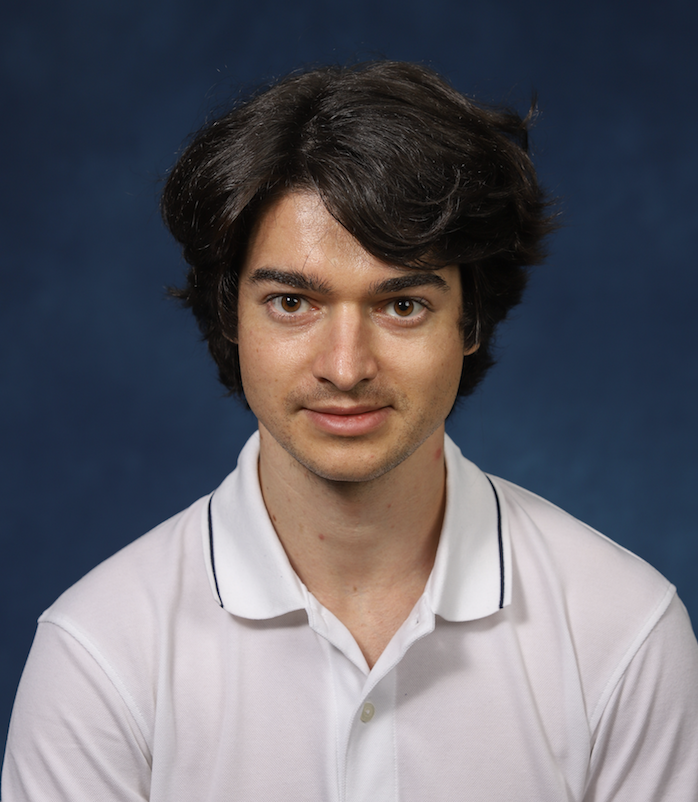

  

Hi! I'm Marius Constantin. I'm an HFT Trader and Quant Researcher.

I am a Quantitative Systematic Trader in Equity Options at SIG. Previously, I worked at Dexterity Capital, Goldman Sachs, Yale University and Princeton University.

I did my PhD at Yale, my Master in Financial Engineering at Stevens Institute of Technology. I graduated magna cum laude in Physics from Princeton in 2014.

[Linkedin](https://www.linkedin.com/in/mariusconstantin11/)

[Github](https://github.com/mariusconstantin3011/)

Selected Academic Work:

Yale PhD in Applied Physics: [PRA paper: Multimode lasing in wave-chaotic semiconductor microlasers](https://arxiv.org/abs/1908.05397)

Abstract: We investigate experimentally and theoretically the lasing behavior of dielectric microcavity lasers with chaotic ray dynamics. Experiments show multimode lasing for both D-shaped and stadium-shaped wave-chaotic cavities. Theoretical calculations also find multimode lasing for different shapes, sizes and refractive indices. While there are quantitative differences between the theoretical lasing spectra of the stadium and D-cavity, due to the presence of scarred modes with anomalously high quality factors, these differences decrease as the system size increases, and are also substantially reduced when the effects of surface roughness are taken into account. Lasing spectra calculations are based on Steady-State Ab Initio Laser Theory, and indicate that gain competition is not sufficient to result in single-mode lasing in these systems.

Princeton Senior Thesis in Physics: [Non-Equilibrium Quantum Phases In The Jaynes-Cummings Lattice](https://drive.google.com/file/d/0B6afjoCKic9EVjhZSEp2Qm85Vm8/view?usp=drive_link&resourcekey=0-uwKBR30J19S0OXFqfCzb8g)

Abstract: Superconducting circuits provide a versatile platform for performing on-chip strongly correlated many-body experiments by strongly coupling microwave photons to superconducting qubits. In this thesis we report experimental progress on fabricating a Jaynes-Cummings kagome lattice in which each site is constituted of a microwave resonator strongly coupled to a superconducting transmon qubit, allowing photon hopping between nearest neighbor sites. When driven with a constant power, the lattice allows the investigation of the non-equilibrium steady state regime characteristic of an open quantum system. The strong dispersive coupling between the resonator and the qubit gives rise to hybrid elementary excitations known as polaritons, which have been theoretically shown to exhibit distinct quantum phases determined by the competition between the on-site interaction energy and the nearest neighbor hopping energy. Theoretical calculations for a finite size lattice with an alternative geometry (linear chain) suggest that even in the presence of dissipation one should observe the Mott insulator phase, in which each lattice site has a well defined polariton number, and the superfluid phase, in which polaritons are delocalized. This thesis presents a computationally tractable numerical simulation scheme based on the Gutzwiller wave function ansatz for modeling a finite size lattice in the presence of decay and dissipation. We further report experimental results on a novel local probe that, when integrated into the Jaynes-Cummings lattice, can distinguish between the Mott insulator phase and the superfluid phase by coupling an additional qubit to the central lattice site and thereby performing local photon statistics measurements.

References:

1) A. A. Houck, H. E. Tureci, and J. Koch. On-chip quantum simulation with superconducting circuits. Nature Physics, 8:292-299, April 2012.

2) D. G. Angelakis, M. F. Santos, and S. Bose. Photon-blockade-induced Mott transitions and XY spin models in coupled cavity arrays. Phys. Rev. A, 76 3, September 2007.

3) J. Koch and K. Le Hur. Superfluid-Mott-insulator transition of light in the Jaynes-Cummings lattice. Phys. Rev. A, 802:023811, August 2009.

4) S. Schmidt and J. Koch. Circuit QED lattices: Towards quantum simulation with superconducting circuits. Annalen der Physik, 525:395-412, June 2013.

Selected Courses:

Physics at Princeton: 

1) Introduction to Quantum Theory PHY305

2) Implementations of Quantum Information ELE568 

3) Science and Technology of Nuclear Energy AST309

4) Quantum Optics A ELE456 

5) Biological Physics PHY412

6) Condensed Matter Field Theory Grad Only Seminar PHY090

Computer Science at Princeton: 

1) Algorithms and Data Structures COS226

2) Programming Systems COS217

3) Reasoning about Computation COS340

4) Artificial Intelligence COS402

5) Reasoning about Computation COS340

Math at Princeton: 

1) Analysis II: Complex Analysis MAT331 

2) Mathematics in Engineering I MAE305

3) Mathematics in Engineering II MAE306 

Physics at Yale: 

1) APHY 677 Noise Dissipation & Amplification

2) APHY 549 Solid-State Physics II

3) APHY 633 Intro to Superconductivity

4) PHYS 691 Quantum Optics

Financial Engineering at Stevens: 

1) Stochastic Calculus for Financial Engineers

2) Pricing and Hedging

3) Portfolio Theory and Applications

4) Financial Risk Management

5) Advanced Derivatives

